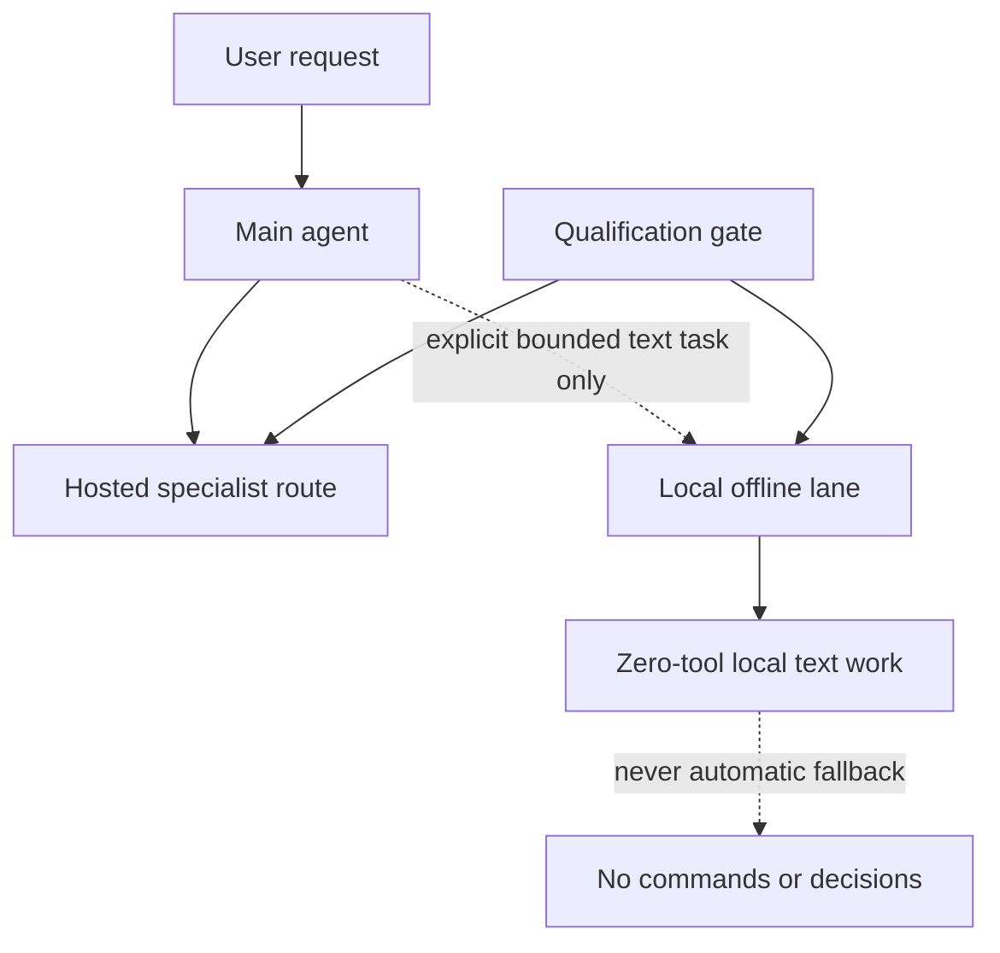

# Reusing a 2013 Mac Pro as an OpenClaw Agent Host

A 2013 Mac Pro 6,1 still had useful work left in it. This project gives it a clear job: host Thumbo, a career-support OpenClaw agent.

The machine runs Nobara Linux with one Intel Xeon E5-2697 v2, two AMD FirePro D700 GPUs with 6 GiB VRAM each, and an official Apple 64 GB memory kit.

Thumbo helps with résumé and supporting-material preparation, research, organization, interview preparation, and related career-support drafting. A person reviews and approves consequential work and any external action. It does not submit materials or conduct outreach on its own.

The Mac Pro hosts the agent environment, storage, and workflow. Normal work uses hosted routes. Local D700/Vulkan inference was tested as a separate, limited option.

**Status:** The host, Thumbo workflow, and verification pack are usable. This documents one working host; it is not a software product or a broad hardware benchmark.

## What the reuse achieved

The machine now has a specific job. It does not need to do every job.

- It hosts the OpenClaw environment used by Thumbo.
- Hosted specialist routes handle normal agent work.
- Human approval is required before consequential career-support work or external action.
- The public pack records the hardware, routing limits, and checks.

No claim is made about uptime, throughput, cost savings, usage volume, application outcomes, or autonomous capability.

## Local inference: historic result

The original local work ran with about 32 GiB of system memory. Vulkan GPU-offload generation did not meet the reliability threshold for automatic routing on this platform.

That result still matters. Local generation is not an automatic fallback, command generator, or decision-maker. The normal path remains hosted routes.

The local lane is limited to explicit, bounded, zero-tool text work. A route must qualify before it can be promoted beyond a test.

## 64 GB upgrade and follow-up testing

An official Apple 64 GB DDR3 ECC kit was installed on **2026-08-19**. Linux currently reports approximately **62.75 GiB** usable.

The post-upgrade work on 2026-08-20 changed what could be loaded. It did not erase the earlier Vulkan result or make local inference an automatic route.

- Qwen2.5-Coder-32B-Instruct Q4_K_M became technically loadable. Its exact sentinel completed in 373.235 seconds at 0.3 generated token/s. The practical suite stopped during its first case before a response token, so it is not useful or qualified.
- Qwen3.5-9B Q4_K_M, official Qwen3-8B Q4_K_M, and Qwen3.5-4B Q4_K_M loaded and returned an exact sentinel in bounded, network-isolated 4K tests. None passed the complete interactive speed-admission gate, so their conditional interactive-usefulness suites did not run.
- Qwen3.5-4B Q4_K_M also had a separate frozen short-task usefulness suite. It passed **5/5**, including the mandatory authorization stop, with no retries, repairs, hints, carryover, scorer changes, timeouts, safety stops, or reasoning leakage.

That 5/5 result is narrow: manual, short, bounded, supplied-text work with human review under the exact 4K hybrid envelope. Qwen3.5-4B is not deployed and is not automatically routed.

Current offline OpenClaw configuration uses `ollama/thumbo-safe:latest`. There is no Qwen3.5-4B provider, alias, route, or binding. Packaging, route mutation, and effective-route testing are still pending.

The completed post-upgrade measurements were safety-clean within their recorded envelopes: no qualifying kernel/Vulkan fault, thermal breach, EDAC change, or residual inference process.

Read the evidence:

- [Hardware Upgrade and Current State](docs/hardware-upgrade-and-current-state.md)
- [Post-upgrade Local Qualification](evidence/post-upgrade-local-qualification-2026-08-20.md)
- [Qwen3.5-4B Short-Task Qualification](evidence/qwen35-4b-short-task-qualification-2026-08-20.md)
- [Local-model Qualification](docs/local-model-qualification.md)

## Architecture



For routing rules and failure behavior, read [Architecture](docs/architecture.md).

## How the agent work is split

The work is split across coordination, career context, research, writing, code, media, and outbound-copy preparation. Each lane gets only the tools and delegation authority needed for its work.

The documented checks include:

- Main-to-Coder work on the intended Sol/high route with workspace-only coding tools and no fallback.
- Career tests that preserved supplied facts and did not authorize external action.
- A Writer policy probe that allowed an in-workspace read and denied an outside read before content disclosure.
- A Researcher lookup using `web_search` and `web_fetch`; the cross-agent bridge stripped configured `browser` and `read`, a documented limitation.
- Broadcaster draft work with zero tools and no send or publish surface.

OpenClaw/Gateway `2026.7.1-2` passed installed-schema validation. The Gateway remained loopback-only. The final deep audit reported 0 critical findings, 4 warnings, and 2 informational findings. Those are results from this bounded deployment, not production certification or external validation.

More detail: [Multi-Agent Topology](docs/multi-agent-topology.md).

## Public source of truth

This repository is the sole source of truth for **publicly shareable** documentation about Thumbo: progress, architecture, evidence boundaries, update outcomes, known limitations, and current operating claims. Private configuration and security-sensitive operational material remain private by design.

- [Operations History and Reliability Record](docs/operations-history.md)
- [Current Operating State](docs/current-operating-state.md)

## Verify the public pack

```sh
make test
```

This runs the public-pack verifier and its contract test. It checks local Markdown links, required public artifacts, repository layout, and obvious private-path or secret-like text.

It does not reproduce hardware behavior, validate a provider, prove runtime behavior, or establish provider availability.

## Key documents

- [Decision Record](docs/decision-record.md)
- [Evidence and Limits](docs/evidence.md)
- [Known Issues](docs/known-issues.md)
- [Building and Verification](docs/building.md)
- [System Profile](docs/system-profile.md)
- [Safety Controls](docs/safety-controls.md)
- [Qualification Protocol](docs/qualification-protocol.md)
- [Operational Model](docs/operational-model.md)
- [CHANGELOG.md](CHANGELOG.md)

The repository also contains [docs/](docs/), [scripts/](scripts/), [test/](test/), [fixtures/](fixtures/), and [evidence/](evidence/). They hold the public documentation, verifier, contract test, minimal non-sensitive examples, and sanitized observations.

## Privacy and scope

This is a sanitized public case study. It does not publish credentials, private configuration, host identifiers, account data, raw session records, or security-sensitive recovery procedures.

It does not claim that a driver or Vulkan reliability problem was fixed, and it does not generalize results to all AMD hardware. Private notes, guarded-test records, and operational runbooks were used to cross-check the public account; they are not in this repository.

## License

[MIT](LICENSE)
