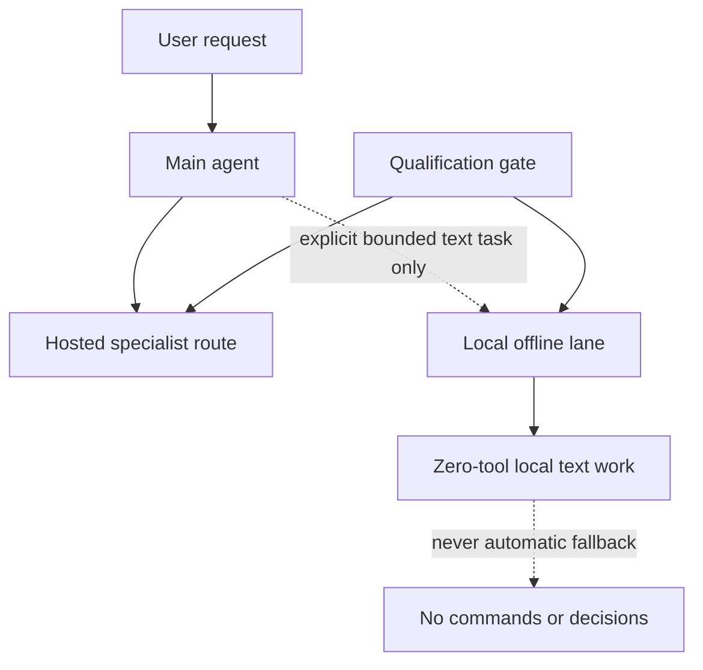

# Mac Pro 6,1/D700 — OpenClaw Infrastructure Case Study

> A documented infrastructure decision: qualify the workload, define the safe boundary, and route around what the platform cannot reliably do.

This case study examines an OpenClaw agent environment on a 2013 Mac Pro 6,1 with dual AMD FirePro D700 GPUs (6 GiB VRAM each), running Nobara Linux. The objective was not to produce an impressive demo on legacy GPUs, but to determine which AI workloads the host could safely support and design the operating model around that result.

**Status:** a public, verification-backed systems case study—not a deployable software release or a universal hardware benchmark.

---

## Outcome

Local generative inference using Vulkan GPU offload did not meet the reliability threshold for automatic routing on this platform. The resulting architecture therefore:

- **Qualifies a route before promoting it** from a demonstration
- **Uses hosted specialist routes** for normal agent work
- **Restricts local generation** to an explicit, bounded, zero-tool text lane
- **Never treats that local lane** as an automatic fallback, command generator, or decision-maker

A reliability boundary is a useful result when it is documented, enforced, and easily revisited.

---

## What This Demonstrates

| Area | Takeaway |
|------|----------|
| **Systems engineering** | Practical validation under constrained hardware and budget limits |
| **Risk-based architecture** | Isolate a fault domain rather than normalize it |
| **Guardrails** | Clear boundaries for routing, tool access, and fallback behavior |
| **Qualification method** | Staged gates covering structured output, retrieval, safe reasoning, tool use, and operational behavior |
| **Honest communication** | Published claims separated from private operational records and unverified conclusions |

---

## Architecture at a Glance



Full routing rules and failure behavior: [Architecture](docs/architecture.md)

---

## Repository Layout

| Path | Purpose |
|------|---------|
| [`docs/`](docs/) | Architecture, decision record, evidence limits, and open work |
| [`scripts/`](scripts/) | Portable public-pack verification |
| [`test/`](test/) | Contract test for the published repository shape |
| [`fixtures/`](fixtures/) | Minimal, non-sensitive examples of permitted public evidence |
| [`evidence/`](evidence/) | Sanitized test records and observations |
| [`CHANGELOG.md`](CHANGELOG.md) | Dated verified changes and work in progress |

---

## Documentation Index

| Document | Purpose |
|----------|---------|
| [Architecture](docs/architecture.md) | Routes, boundaries, and failure behavior |
| [Decision Record](docs/decision-record.md) | Problem, qualification method, and resulting decision |
| [Evidence and Limits](docs/evidence.md) | What supports the public claims—and what does not |
| [Known Issues](docs/known-issues.md) | Open technical gaps and non-goals |
| [Building and Verification](docs/building.md) | Public-pack checks and reproducibility limits |
| [System Profile](docs/system-profile.md) | Hardware constraints and workload definition |
| [Safety Controls](docs/safety-controls.md) | Guardrails, stop conditions, and fault containment |
| [Qualification Protocol](docs/qualification-protocol.md) | Gates, evidence requirements, and disposition rules |
| [Local-model Qualification](docs/local-model-qualification.md) | D700 test vectors, strict results, reproduction order, and exclusions |
| [Operational Model](docs/operational-model.md) | Specialist routing and controlled degradation |

---

## Quick Start: Verify the Public Pack

```sh
make test
```

This runs the public-pack verifier and its contract test. The checks validate:

- Local Markdown links
- Required public artifacts
- Repository layout
- Obvious private-path or secret-like text

They do **not** reproduce hardware behavior, validate a provider, or turn a static document pack into a benchmark.

---

## Scope and Disclosure

This is a sanitized, single-host case study. It does **not** publish:

- Credentials, private configuration, host identifiers, or account data
- Raw session records or security-sensitive recovery procedures
- Claims that a driver or Vulkan reliability problem was fixed
- Results that generalize to all AMD hardware

The public narrative was derived from private technical notes, guarded-test records, and operational runbooks. Those sources were used to cross-check the architecture; they are not part of this repository and should not be inferred from it.

---

## Contact

Open to systems engineering, ML infrastructure, platform reliability, and data operations opportunities where practical judgment matters.

---

## License

[MIT](LICENSE)