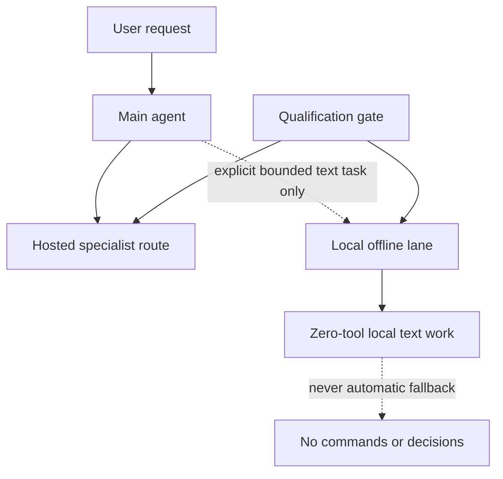

# Reusing a 2013 Mac Pro as an OpenClaw Agent Host

> Old hardware doesn't need to do everything. It needs a durable job it can do well.

This case study documents the successful reuse of a 2013 Mac Pro 6,1 as the durable host and orchestrator for **Thumbo**, a human-supervised career-support OpenClaw agent. The machine has one Intel Xeon E5-2697 v2, two AMD FirePro D700 GPUs with 6 GiB VRAM each, an official Apple 64 GB memory kit, and Nobara Linux.

Thumbo was built first and foremost for résumé and supporting-material preparation, research, organization, interview preparation, and related career-support drafting. Consequential work remains subject to human review and approval; the system does not autonomously submit materials or conduct outreach.

The Mac Pro provides the durable agent environment, storage, workflow, and control surface. Hosted inference is an intentional part of the architecture, selected when it best satisfies the capability, reliability, and safety requirements. Local D700/Vulkan inference is one separately qualified subsystem boundary, not the measure of whether the reuse project succeeded.

**Status:** the host, routed Thumbo workflow, and verification pack are usable. This is a public systems case study—not a deployable software release, universal hardware benchmark, production certification, or claim that all inference runs locally.

---

## Reuse Outcome

The practical result is a durable role for capable legacy hardware:

- The Mac Pro hosts and coordinates the OpenClaw environment used by Thumbo.
- Role-specific hosted routes supply capabilities that the local GPUs have not qualified to provide.
- Human approval remains the boundary for consequential career-support work and any external action.
- Hardware, routing, and evidence limits are documented instead of hidden behind a demo.
- The public pack retains reproducible checks and sanitized records without exposing private operations.

No uptime, throughput, cost savings, usage volume, application outcome, or autonomous capability is inferred from this outcome.

## Historic Local-Qualification Outcome

The original local usefulness work ran with approximately 32 GiB system memory. The following historic disposition remains part of the current architecture:

Local generative inference using Vulkan GPU offload did not meet the reliability threshold for automatic routing on this platform. The resulting architecture therefore:

- **Qualifies a route before promoting it** from a demonstration
- **Uses hosted specialist routes** for normal agent work
- **Restricts local generation** to an explicit, bounded, zero-tool text lane
- **Never treats that local lane** as an automatic fallback, command generator, or decision-maker

A reliability boundary is a useful result when it's documented, enforced, and easily revisited.

## Post-Upgrade Qualification — 2026-08-20

An official Apple 64 GB DDR3 ECC kit was installed on 2026-08-19; current Linux reporting is approximately 62.75 GiB usable. Guarded post-upgrade work was performed and is not absent:

- Qwen2.5-Coder-32B-Instruct Q4_K_M moved from capacity-blocked to technically loadable. Its exact sentinel completed in 373.235 seconds at 0.3 generated token/s; the practical suite was then stopped during its first case before a response token, so it remains not useful and not qualified.
- Qwen3.5-9B Q4_K_M, official Qwen3-8B Q4_K_M, and Qwen3.5-4B Q4_K_M each loaded and returned an exact sentinel in bounded, network-isolated 4K tests. Each failed its complete interactive speed-admission gate; the conditional interactive-usefulness suites therefore did not run.
- Qwen3.5-4B then passed a **separate frozen short-task usefulness suite 5/5**, including the mandatory authorization stop, with no retries, repairs, hints, carryover, scorer changes, timeouts, safety stops, or reasoning leakage. It is admitted only for explicit, manual, short, bounded, supplied-text work with human review under the exact 4K hybrid envelope.
- The completed post-upgrade measurements were safety-clean within their recorded envelopes, with no qualifying kernel/Vulkan fault, thermal breach, EDAC change, or residual inference process.

The 5/5 result is a bounded success, but the candidate is **not live or deployed**: current OpenClaw offline configuration still uses `ollama/thumbo-safe:latest`, with no Qwen3.5-4B provider, alias, route, or binding. Packaging, route mutation, and effective-route testing remain pending. These later results do **not** show that added RAM fixed the historic Vulkan fault, qualify interactive or automatic routing, establish long-context behavior, or erase earlier negative evidence. See [Qwen3.5-4B Short-Task Qualification](evidence/qwen35-4b-short-task-qualification-2026-08-20.md), [Post-upgrade Local Qualification](evidence/post-upgrade-local-qualification-2026-08-20.md), and [Hardware Upgrade and Current State](docs/hardware-upgrade-and-current-state.md).

---

## What This Demonstrates

| Area | Takeaway |
|------|----------|
| **Systems engineering** | Practical validation under constrained hardware and budget limits |
| **Risk-based architecture** | Isolate a fault domain rather than normalize it |
| **Guardrails** | Clear boundaries for routing, tool access, and fallback behavior |
| **Qualification method** | Staged gates covering structured output, retrieval, safe reasoning, tool use, and operational behavior |
| **Honest communication** | Published claims separated from private operational records and unverified conclusions |

---

## Multi-Agent Operations

The current OpenClaw design separates coordination, durable context, research,
writing, code, media, and outbound-copy preparation into explicit lanes. Each
lane receives only the tools and delegation authority its role requires.

| Lane | Enforced boundary | Verified behavior |
|------|-------------------|-------------------|
| **Main** | Delegates only to Career, Researcher, Writer, Coder, Vision, and Broadcaster | Direct Main-to-Coder work completed on the intended Sol/high route with workspace-only coding tools and no fallback |
| **Career** | Owns fact-locked career context; delegates only to Researcher and Writer | Fictional ranking and nested delegation tests preserved the supplied facts and did not authorize external action |
| **Writer** | Workspace-only `read`, `write`, `edit`, and `apply_patch`; no runtime, web, messaging, or publishing | A deterministic host-policy probe allowed an in-workspace read and denied an outside read before content disclosure |
| **Researcher** | Search/read role with no runtime or write tools | A nested sourced lookup succeeded with `web_search` and `web_fetch`; the installed cross-agent bridge stripped configured `browser` and `read`, which remains a documented limitation |
| **Broadcaster** | Zero tools; draft preparation only | Preserved supplied facts in a short announcement and had no send or publish surface |
| **Modality specialists** | Vision, speech generation, and transcription are tested only through their proper input surfaces | Harmless image, local speech, and transcription checks completed without external delivery |

**Current status:** OpenClaw/Gateway `2026.7.1-2` passed installed-schema
validation. The Gateway remained loopback-only, and the final deep audit
reported 0 critical findings, 4 warnings, and 2 informational findings. These
results document one bounded deployment; they are not production certification,
zero-warning status, or external validation.

---

## Architecture at a Glance



Full routing rules and failure behavior: [Architecture](docs/architecture.md)

---

## Repository Layout

| Path | Purpose |
|------|---------|
| [`docs/`](docs/) | Architecture, decision record, evidence limits, and open work |
| [`scripts/`](scripts/) | Portable public-pack verification |
| [`test/`](test/) | Contract test for the published repository shape |
| [`fixtures/`](fixtures/) | Minimal, non-sensitive examples of permitted public evidence |
| [`evidence/`](evidence/) | Sanitized test records and observations |
| [`CHANGELOG.md`](CHANGELOG.md) | Dated verified changes and work in progress |
| [`docs/multi-agent-topology.md`](docs/multi-agent-topology.md) | Delegation, route-admission gates, enforcement, and partial dispositions |
| [`docs/hardware-upgrade-and-current-state.md`](docs/hardware-upgrade-and-current-state.md) | Exact hardware chronology, current capacity, portability, and revertibility |
| [`evidence/post-upgrade-local-qualification-2026-08-20.md`](evidence/post-upgrade-local-qualification-2026-08-20.md) | Sanitized post-64GB model/runtime results, hashes, and evidence provenance |
| [`evidence/qwen35-4b-short-task-qualification-2026-08-20.md`](evidence/qwen35-4b-short-task-qualification-2026-08-20.md) | Frozen 5/5 short-task result, exact admitted envelope, safety bounds, and non-deployment state |

---

## Documentation Index

| Document | Purpose |
|----------|---------|
| [Architecture](docs/architecture.md) | Routes, boundaries, and failure behavior |
| [Decision Record](docs/decision-record.md) | Problem, qualification method, and resulting decision |
| [Evidence and Limits](docs/evidence.md) | What supports the public claims—and what does not |
| [Known Issues](docs/known-issues.md) | Open technical gaps and non-goals |
| [Building and Verification](docs/building.md) | Public-pack checks and reproducibility limits |
| [System Profile](docs/system-profile.md) | Hardware constraints and workload definition |
| [Safety Controls](docs/safety-controls.md) | Guardrails, stop conditions, and fault containment |
| [Qualification Protocol](docs/qualification-protocol.md) | Gates, evidence requirements, and disposition rules |
| [Local-model Qualification](docs/local-model-qualification.md) | D700 test vectors, strict results, reproduction order, and exclusions |
| [Operational Model](docs/operational-model.md) | Specialist routing and controlled degradation |
| [Multi-Agent Topology](docs/multi-agent-topology.md) | Specialist boundaries, delegation and verification, route gates, and failure behavior |
| [Hardware Upgrade and Current State](docs/hardware-upgrade-and-current-state.md) | Current exact platform, dated chronology, and upgrade claim boundary |
| [Post-upgrade Local Qualification](evidence/post-upgrade-local-qualification-2026-08-20.md) | Bounded 2026-08-20 qualification results and source map |
| [Qwen3.5-4B Short-Task Qualification](evidence/qwen35-4b-short-task-qualification-2026-08-20.md) | Separate manual short-task admission, frozen suite, and deployment boundary |

---

## Quick Start: Verify the Public Pack

```sh
make test
```

This runs the public-pack verifier and its contract test. The checks validate:

- Local Markdown links
- Required public artifacts
- Repository layout
- Obvious private-path or secret-like text

They do **not** reproduce hardware behavior, validate a provider, or turn a static document pack into a benchmark.

---

## Verifier Scope

The verifier is a static, deterministic check of the published repository. It
cannot prove:

- Runtime correctness of any route or tool
- Hardware behavior under load
- Provider service levels or continued availability
- Security of private operational records

---

## Scope and Disclosure

This is a sanitized, single-host case study. It does **not** publish:

- Credentials, private configuration, host identifiers, or account data
- Raw session records or security-sensitive recovery procedures
- Claims that a driver or Vulkan reliability problem was fixed
- Results that generalize to all AMD hardware

The public narrative was derived from private technical notes, guarded-test records, and operational runbooks. Those sources were used to cross-check the architecture; they are not part of this repository and should not be inferred from it.

---

## License

[MIT](LICENSE)
