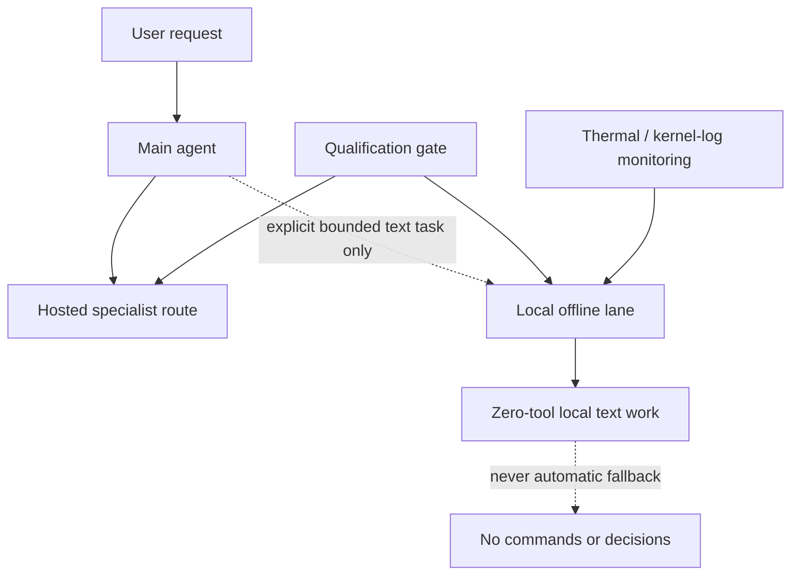

# Architecture

## Routing Model

## Routes

| Route | Scope | Qualification | Tools | Fallback |
|-------|-------|---------------|-------|----------|
| **Hosted specialist** | Normal agent work: research, coding, writing, image analysis, transcription, speech, data handling | Per-role, per-provider qualification (see [Qualification Protocol](qualification-protocol.md)) | Full tool access per role | Verified alternative within same role |
| **Local offline lane** | Explicit, bounded, zero-tool text tasks: summarization, rewriting, extraction, classification, formatting | Must pass all four semantic gates under safety envelope (see [Local-model Qualification](local-model-qualification.md)) | None | None — failure surfaces to operator |

## Failure Behavior

- **Hosted route failure**: surfaces visibly or uses a verified alternative within the same role. **Never** crosses into local inference automatically.
- **Local lane failure**: stops the task. The boundary holds — no silent substitution.
- **Hardware safety signal** (GPU reset, ring timeout, thermal watchdog, kernel fault): immediate run termination, blocks promotion.

## Design Principles

1. **Qualify before route** — no promotion from demo alone
2. **Role-specific admission** — a model is admitted to a defined role with defined tool boundary
3. **Zero-tool local lane** — eliminates hidden command generation or operational decisions
4. **Observable failure** — the system gives up capability openly instead of quietly exchanging a known-safe boundary for an unknown one
5. **Revisit with evidence** — boundary changes require a new guarded qualification run with sanitized artifacts

## Related Documents

- [Decision Record](decision-record.md) — why this boundary exists
- [Qualification Protocol](qualification-protocol.md) — gates and promotion rules
- [Local-model Qualification](local-model-qualification.md) — exact test vectors and results
- [Safety Controls](safety-controls.md) — stop conditions and containment
- [Operational Model](operational-model.md) — specialist routing in practice