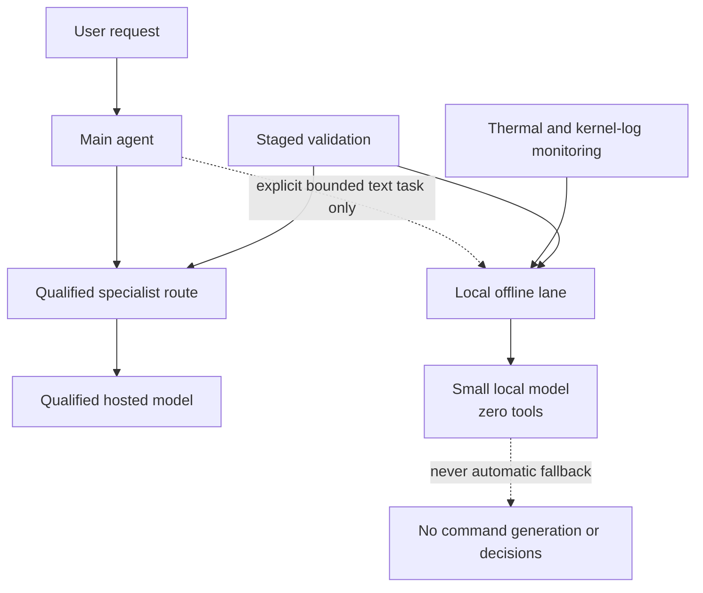

# Architecture Overview

The production path is based on qualified hosted routes selected for specialist roles. The local lane is intentionally narrow: it handles only explicit, bounded, zero-tool text tasks and is never used as an automatic fallback or decision-making route.

The design reflects the platform’s measured reliability boundary rather than a preference for local inference at any cost.
