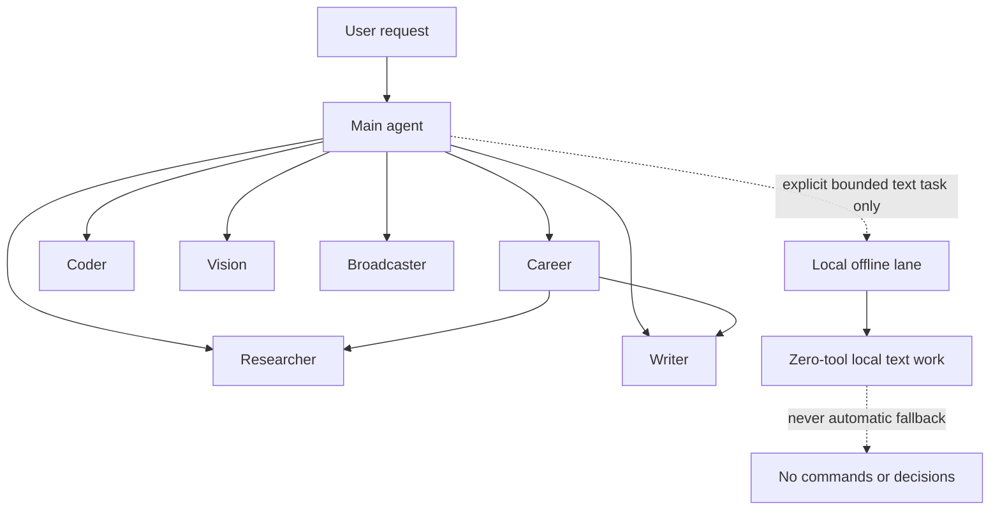

# Architecture

## Routing Model

Main answers simple general requests directly. Substantial specialist work uses
isolated child context by default, concise task briefs, and explicit agent IDs.
Career-to-specialist work is permitted at the second delegation depth, but
Career cannot delegate to Coder.

## Routes and Specialists

| Agent or route | Role and delegation scope | Tool boundary and verified behavior |
|----------------|---------------------------|-------------------------------------|
| **Main** | General coordinator; delegates only to Career, Researcher, Writer, Coder, Vision, and Broadcaster | Owns the final user-visible response and reviews specialist results |
| **Career** | Persistent, fact-locked career context; delegates only to Researcher and Writer | No application, employer contact, publication, or unsupported career claim is authorized |
| **Researcher** | Sourced information retrieval | No runtime or write tools; a nested test exposed `web_search` and `web_fetch`, while the installed bridge stripped configured `browser` and `read` |
| **Writer** | Prose, editing, structure, and tone | Workspace-only `read`, `write`, `edit`, and `apply_patch`; no runtime, web, messaging, or publishing |
| **Coder** | Direct Main-to-Coder software and infrastructure work on the Sol/high route | Workspace-only `read`, `write`, `edit`, `apply_patch`, `exec`, and `process`; create/read/edit/hash/delete passed without fallback |
| **Broadcaster** | Outbound-copy preparation | Zero tools; returns drafts for approval and cannot send or publish |
| **Vision, TTS, Transcriber** | Modality-specific image, speech-generation, and transcription work | Used only through the appropriate modality surface |
| **Local offline lane** | Explicit, bounded supplied-text work | Zero tools, never automatic, and never used for commands or operational decisions |

The Researcher result is intentionally recorded as a partial limitation rather
than a complete four-tool pass. Search and fetch worked, but cross-agent tool
inheritance did not preserve browser or local-read access.

## Failure Behavior and Security

- **Hosted route failure:** surface the failure or use a qualified hosted
  alternative within the same role. Never cross into local inference
  automatically.
- **Local lane failure:** stop the task. Do not silently substitute a broader
  or more privileged route.
- **External actions:** drafting and research do not grant authority to send,
  publish, apply, contact, spend, or commit on a user's behalf.
- **Gateway boundary:** the tested Gateway was loopback-only. Installed-schema
  validation passed; the final deep audit reported 0 critical findings, 4
  warnings, and 2 informational findings. This is not a zero-risk claim.
- **Hardware stop signal:** thermal limits, GPU reset, ring timeout, device
  loss, or relevant kernel faults end a guarded qualification run and block
  promotion.

## Design Principles

1. **Qualify before routing** — no promotion from a demonstration alone.
2. **Role-specific admission** — every lane has a defined purpose, tool surface,
   and delegation boundary.
3. **Least privilege** — modality, writing, research, coding, and outbound-copy
   preparation do not share one general tool profile.
4. **Zero-tool local lane** — local generation cannot become a hidden command
   generator or recovery fallback.
5. **Observable failure** — give up capability openly instead of quietly
   exchanging a known boundary for an unknown one.
6. **Revisit with evidence** — changes require a new guarded qualification run
   with sanitized artifacts.

## Related Documents

- [Decision Record](decision-record.md) — why the local boundary exists
- [Qualification Protocol](qualification-protocol.md) — gates and promotion rules
- [Local-model Qualification](local-model-qualification.md) — exact test vectors and results
- [Safety Controls](safety-controls.md) — stop conditions and containment
- [Operational Model](operational-model.md) — specialist routing in practice
